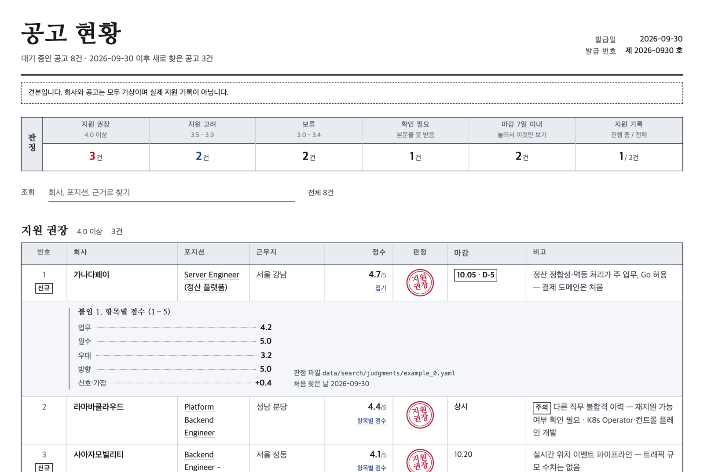

<h1 align="center">jobhunt</h1>

<p align="center">
  Find Korean developer job postings, score how well each one fits you, write a tailored resume and cover letter for each, then prepare the interviews and track every application.<br/>
  An agent skill for Codex, Claude Code, Grok and any other AI agent — it gets sharper the more you use it.
</p>

<p align="center">
  
  
  
  
  
</p>

<p align="center">
  <a href="./README.md">한국어</a> | <a href="./README.en.md">English</a>
  <br/>
  <a href="#-preview">Preview</a> · <a href="#-quick-start">Quick Start</a> · <a href="#-1-find-postings">Find</a> · <a href="#-2-fit-evaluation">Evaluate</a> · <a href="#-3-tailored-resume">Tailor</a> · <a href="#-personalization-that-compounds">Personalization</a> · <a href="#-project-structure">Structure</a>
</p>

## 📖 Overview

<p align="center"></p>

**jobhunt** is an AI agent skill (`SKILL.md` and `AGENTS.md`) plus Python scripts. It is not tied to one AI: Codex, Claude Code, Grok, Gemini, Cursor, or any agent that can read files in this folder and run commands follows the same steps.

- **Scripts:** Mechanical work (collecting postings, checking whether they're still open, updating the tracker) runs without an LLM.
- **AI agent:** Handles the judgment calls (does this posting fit you? what should the resume lead with?) by following the procedures in `modes/`.
- **Your data:** Everything personal stays under `data/` and never reaches git.

> The tool targets the Korean job market, so its prompts, reports and resumes are written in Korean.

### Highlights

- 🏢 **Widen the company list:** Finds companies that post mainly on their own career sites. It ranks them by reputation and size using tech-blog and GitHub-org lists, Wanted company data (pay band, headcount) and a list of well-known companies, then locates each career site and its hiring system (greetinghr, Ninehire, Greenhouse …) and adds it to the scan.
- 🔎 **Find postings:** Collects from Wanted, Jumpit, LinkedIn, Saramin, Greenhouse boards (Daangn, Coupang, KRAFTON …), Toss, NHN, Kakao, greetinghr, Ninehire, Workday and Workable companies, and in-house career sites with no list on the first screen (through a list API found once during discovery), in one run. It filters by title, required years, location, duplicates across sites (company aliases unify Korean and English names), blocked companies and re-apply cooldowns.
- 📊 **Score the fit:** Checks your location, English and tech-stack rules against quoted posting text, maps every requirement to your own experience, and scores 1–5. Required vs. preferred is told apart by Korean sentence endings ("~필요해요" vs. "~좋아요").
- 📝 **Tailor the resume:** Turns the evaluation's plan (projects to lead with, skill overlap, wording) into a per-posting YAML, then builds it in one of three designs as an A4 PDF. Every build is checked automatically.
- 📋 **Track applications:** Shows evaluated and triage-passed postings in a single table with "applied?" and "still open?" columns.
- 📈 **Personalization that compounds:** Corrections like "this score is too high" or "you missed my X experience", plus application outcomes, accumulate in dated files under `data/`.
- 🛡️ **No fabrication:** Only facts from your own files are used. Inferred sentences are tagged `[확인 필요]` (needs confirmation), and you always submit applications yourself.
- 🔒 **Safe to publish:** Real files under `data/` are git-ignored; only folder structure and fictional examples are committed.

## 🖼 Preview

### Posting report (`scripts/report_html.py`)

A sample built from fictional companies (`python3 scripts/report_html.py --demo`). It is laid out like a Korean certificate form: a ruled ledger per verdict band, a red seal on recommended postings, D-day marks for deadlines, and an itemised-score attachment per row. It is one HTML file, so any browser or AI agent can open it; hosts that publish HTML pages (e.g. Claude Artifacts) get the `--fragment` version. Design rules live in [`DESIGN.md`](DESIGN.md).

<p align="center"></p>

Text-only hosts can use `python3 scripts/tracker.py report --alive`, which prints the same rows as a table.

### Fit evaluation (`data/job_postings/*.eval.md`, translated)

<p align="center"></p>

### Resume designs

Rendered from the fictional sample [`examples/example.yaml`](examples/example.yaml).

| A · Editorial | B · Swiss Grid (default) | C · Dark Masthead |
|:---:|:---:|:---:|
|  |  |  |

<details>
<summary>Design B, page 2</summary>
<p align="center"></p>
</details>

📄 Full sample PDF: [`assets/example-design-b.pdf`](assets/example-design-b.pdf)

## 🚀 Quick Start

### 1. Install

Requires Python 3.9+ and one of:
- **macOS** (Homebrew)
- **Linux** (Debian/Ubuntu, apt)
- **Windows** (WSL2 + Ubuntu): see [Windows (WSL2)](#windows-wsl2) below

```bash
curl -fsSL https://raw.githubusercontent.com/jojaden/jobhunt/main/install.sh | bash
```

This one line clones the repository into `~/jobhunt` and runs `scripts/setup.sh`, which links the skill and sets up the build environment. If git or python3 is missing, Ubuntu gets them through apt and macOS is pointed to `xcode-select --install`. Running the same command again updates the tool only and leaves `data/` alone.

| Setting | Meaning |
|---|---|
| `JOBHUNT_DIR=path` | Install folder (default `~/jobhunt`) |
| `JOBHUNT_REF=v1.0.0` | Pin a version (tag) or branch |
| `JOBHUNT_REPO=url` | Install from your fork |
| `… \| bash -s -- --no-skill` | Trailing arguments go to `setup.sh` (options below) |

Example: `curl -fsSL https://raw.githubusercontent.com/jojaden/jobhunt/main/install.sh | JOBHUNT_REF=v1.0.0 bash`

<details>
<summary>Manual install (if you'd rather read the script first)</summary>

```bash
git clone https://github.com/jojaden/jobhunt.git ~/jobhunt
cd ~/jobhunt
bash scripts/setup.sh
```

</details>

<a id="windows-wsl2"></a>
<details>
<summary><b>Windows (WSL2)</b></summary>

The scripts use bash and apt, so on Windows they run inside Ubuntu on WSL2.

1. In **PowerShell (as administrator)**, install WSL2 with Ubuntu and reboot:
   ```powershell
   wsl --install -d Ubuntu
   ```
2. Open **Ubuntu** from the Start menu, create a user and password, then run the one-line install command above as it is. `setup.sh` installs pip, Chromium's system libraries, Korean fonts (Noto CJK, Pretendard) and poppler with apt, so it may ask for your sudo password.
3. **Run the AI agent inside WSL too.** Install Codex, Claude Code, etc. in the Ubuntu terminal and start it in `~/jobhunt`, so the skill links (`~/.codex/skills`, `~/.claude/skills`) and `data/` paths line up. With VS Code or Cursor, open the folder through the WSL extension (`code ~/jobhunt`).

Good to know:
- **Keep the install folder under the WSL home (`~`).** Under `/mnt/c/...` (the Windows drive) file access is slow and the skill links can break; `install.sh` stops and `setup.sh` warns about it.
- **Opening the output:** resume PDFs and the posting report HTML are written inside WSL. Run `explorer.exe .` to open the current folder in Windows Explorer, or type `\\wsl$\Ubuntu\home\<user>\jobhunt` into the Explorer address bar.
- **Scheduled scans:** WSL only runs while you are signed in to Windows. To run `weekly.sh` regularly, use cron inside WSL, or register `wsl -d Ubuntu -- bash -lc "~/jobhunt/scripts/weekly.sh"` in Windows Task Scheduler.

</details>

What `setup.sh` does:
- **Connects the agent skill:** finds the agents you have installed and links this folder into their skill folders (Claude Code `~/.claude/skills`, Codex `~/.codex/skills`). It's a link, not a copy, so the personalization that builds up here reaches the skill immediately. Agents that don't load skills follow `AGENTS.md` when started in this folder.
- **Build environment:** installs Python packages, Playwright Chromium, fonts (Pretendard, Noto CJK KR) and poppler.

| Option | Description |
|---|---|
| `--skill-only` | Only connect the skill |
| `--no-skill` | Only the build environment |
| `SKILLS_DIR=path[:path…]` | Link into specific skill folders (other agents, several places) |

If a folder or a link to somewhere else already exists under that name, it's left untouched and you're told what to do.

> **Why `git clone` instead of a marketplace or skill install?**
>
> This skill is meant to become yours the more you use it.
> - **Your criteria live next to the tool.** Target roles, salary and deal-breakers (`data/profile/`), experience evidence (`data/experience/`), search settings and priority companies (`data/search/`), evaluations and applications all accumulate under `data/` inside the repository.
> - **Some installs would lose that history.** A marketplace or plugin install lives in a managed cache folder (e.g. an agent-managed folder like `~/.claude/plugins/cache/…/<version>/`) that is swapped out on every update. Your records and your rule changes would go with it.
> - **Updates leave your data alone.** A clone is your own working copy, so `git pull` brings in tool updates only. `data/` is git-ignored and never touched.
> - **You can change the tool itself.** Job sources (`references/sources.md`, `scripts/providers/`), evaluation rules (`modes/evaluate.md`), writing rules (`references/style_rules.yaml`) and resume design (`scripts/render.py`) are plain files. Fork it, adapt it, and merge upstream changes when you want them.
> - **Your data stays on your machine.** Collection and builds run on your own Python and Chromium, and personal data only ever exists as local files.

Update:

```bash
curl -fsSL https://raw.githubusercontent.com/jojaden/jobhunt/main/install.sh | bash   # or cd ~/jobhunt && git pull (data/ stays as is)
```

Versions are tags such as `v1.0.0`; see [Releases](https://github.com/jojaden/jobhunt/releases) for what changed.

Starting it in each agent:

| Agent | Start |
|---|---|
| Codex | `cd ~/jobhunt && codex` — reads `AGENTS.md`, and the skill is linked into `~/.codex/skills` |
| Claude Code | `cd ~/jobhunt && claude` — `CLAUDE.md` imports `AGENTS.md`, and the skill is linked into `~/.claude/skills` |
| Grok, Gemini, Cursor, others | open the agent in this folder and say "read `AGENTS.md` and start" |

Features that differ between agents, such as web search (Firecrawl, …) or publishing HTML pages (Claude Artifacts, …), are used when present; without them the agent gives you the file path or reports that channel as not scanned.

### 2. Talk to your AI agent

| Say | What happens |
|---|---|
| "처음 설정해줘" (set me up) | Asks for target roles, salary, location and deal-breakers, and writes your criteria to `data/profile/` |
| "공고 찾아줘" (find postings) | Runs `weekly.sh`, triages new postings against your criteria, shows the overview table |
| (paste a URL) "이 공고 어때?" (how is this one?) | Verdict and score, condition checks, requirements-vs-experience map, application strategy |
| "이 공고용 이력서 만들어줘" (make a resume for it) | Writes the YAML from the plan → builds the PDF → checks → revises |
| "자소서 써줘" (write the cover letter) | Drafts each application question with a fitting structure, checks character limits and style (`cover_check.py`) |
| "이 회사 조사해줘" (research this company) | Product, team, stack, engineering culture, company state and red flags, with sources (material for motivation and reverse questions) |
| "면접 준비해줘" (prepare the interview) | A practice sheet: per-stage prep, resume-driven questions with follow-ups, technical and behavioral questions, reverse questions |
| "모의 면접 해줘" (mock interview) | Asks one question at a time like an interviewer, follows up on your answer, short feedback after each |
| "지원했어" / "서류 붙었어" / "면접 봤어" (applied / passed / interviewed) | Updates the tracker, applies the re-apply cooldown, logs the interview, analyzes causes and suggests criteria changes as results accumulate |
| "메뉴" (menu, or just a mode name) | The available modes and the next step that fits where you are |

### 3. Use the scripts on their own

```bash
bash scripts/weekly.sh                             # collect → liveness check → overview (no LLM, cron/launchd friendly)
python3 scripts/scan.py --dry-run                  # see what would be collected without writing files
python3 scripts/report_html.py                     # posting report as HTML (data/search/reports/postings.html)
python3 scripts/tracker.py report --alive          # the same rows as a text table
python3 scripts/tracker.py set 3 지원함             # record an application
python3 scripts/render.py examples/example.yaml \
  --profile data/profile/profile.example.yaml --offline   # build the sample resume
```

## 🔎 1. Find Postings

`scripts/scan.py` collects postings and saves the full requirement text to `data/search/inbox/`. The AI agent then triages them against `data/profile/brief.md`.

| Source | Method | Automated by |
|---|---|---|
| Wanted, Jumpit | Public JSON list and detail | `scan.py` |
| LinkedIn | Public guest API, Korean-language postings only (English-only JDs excluded) | `scan.py` |
| Saramin | Search-page HTML → posting detail | `scan.py` |
| Greenhouse and Lever companies (Daangn, Coupang, KRAFTON, Channel Talk …) | Official public API | `scan.py` |
| Toss (all affiliates), NHN, Kakao, greetinghr and Ninehire companies, career pages whose HTML links each posting | Career-site JSON / HTML | `scan.py` (companies found by `discover.py`) |
| Workday, Workable, Ashby, JOBFLEX (recruiter.co.kr), roundHR and SK Careers companies | Hiring system's public list API | `scan.py` (`discover.py` identifies and verifies the system) |
| In-house career sites with no posting list on the first screen (behind a tab or button, script-rendered) | List API (`jsonapi`) or sitemap found once during discovery | `scan.py` (`discover.py probe` finds it with a headless browser; the weekly scan needs no browser) |
| JobKorea, Remember, career sites that block bots or need a token | HTML / browser / Firecrawl | The AI agent, following each company's reading recipe (`browse` in `sources.yaml`) and the per-type table in [`references/judgment.md`](references/judgment.md) §2; results appear in the report's "직접 확인한 곳" section |

- **What gets filtered out:** title keywords, required years (when the posting states them), location, postings you've already seen (including the same posting on another site), blocked companies, companies you applied to recently (6-month cooldown by default), and English-only JDs (when enabled).
- **What doesn't:** the tech stack is never used as a filter at collection time. Narrowing the search to one language drops good postings that accept any language. The script only attaches a required/preferred hint, and the stack is judged during triage.
- **Open or closed:** `scripts/alive.py` checks each site's detail API. A posting missing from a public list is not treated as closed.

## 📊 2. Fit Evaluation

[`modes/evaluate.md`](modes/evaluate.md) answers "should I apply?" in this order and saves `data/job_postings/<posting>.eval.md`.

| Section | Contents |
|---|---|
| Verdict | Score and verdict with per-item scores, one-line reason, location / language / salary summary |
| The seat | What the company and team build, the daily work, employment type, years, deadline, closest target role |
| Conditions | Location, English, tech stack, years, employment type and salary floor, each pass / exclude / unclear with a quoted sentence |
| Requirements vs. my experience | Every requirement and preferred item ↔ your experience (with evidence file), met / partly / no, handling for each gap |
| Pay and terms | Korean hiring terms such as inclusive-wage contracts, probation, bonuses, stock options, remote policy |
| Application strategy | Resume plan (base, project order, skills, wording, summary direction), a story per cover-letter question, first likely interview questions |
| Open points | Posting date and reposts, company facts that contradict it, AI-targeted instructions in the posting, questions for the recruiter |

The AI agent classifies the posting line by line (have you done this work, is each required item met, which preferred items are core skills of the position, is this the kind of work you want), and `scripts/score.py` computes the score in two layers.

- **Common rules (the same for everyone):** coverage of the required and preferred lines sets the band. Everything met: 4.9+. Required plus the position's key preferred skills: 4.5+. Required plus at least half of the preferred: 4.0+. A required line or a key preferred skill missing: 3.9 or below.
- **Personal preferences:** wanted and avoided work and bonuses (`data/profile/targets.yaml`) only reorder postings inside a band.

After the calculation the agent rereads the whole posting (seniority and scope, what the hiring side weighs) and records any adjustment with its reason in the judgment file ([`references/judgment.md`](references/judgment.md)). Location and compensation are pass/fail rules, not score components. The criteria live in [`references/scoring.md`](references/scoring.md).

## 📝 3. Tailored Resume

[`modes/tailor.md`](modes/tailor.md) drives the steps. If an evaluation exists, the resume plan in its "application strategy" becomes the default.

| Step | What the agent does |
|---|---|
| 0. Direction | Shows the tailoring plan and picks the closest base resume (`base_*.yaml`) |
| 1. Material | Gathers project candidates with evidence from docs, local git logs (`scripts/git_log.sh`), GitLab MRs and old resumes |
| 2. Requests | Records what to emphasize, what to leave out and the page count, for this posting or for good |
| 3. Portfolio | GitHub/blog links, related posts per project, link checks |
| 4. Write & build | Writes the YAML (inferred sentences tagged `[확인 필요]`), builds PDF + PNG with `render.py` |
| 5. Review | Check results, before/after rewrites, and confirmation of every tagged fact, repeated until final |

**Build options** (`python3 scripts/render.py <yaml>`)

| Option | Description |
|---|---|
| `--design A\|B\|C` | Design (default: `meta.design` in the YAML, otherwise B) |
| `--profile PATH` | Personal info YAML (default: `data/profile/profile.yaml`) |
| `--out DIR` | Output folder (default: `data/output`) |
| `--offline` | Skip link reachability checks |
| `--no-png` / `--no-check` | Skip PNG previews / post-build checks |

**Build checks** (`scripts/check.py`)

| Check | Rule | Level |
|---|---|---|
| Page count | `meta.target_pages` (default 2–3) | Error |
| Orphaned heading | Fewer than 3 body lines after a heading on the same page | Error |
| Links | Every link in the PDF must open | Error (unreachable) / Warning (unknown) |
| Placeholders | `【 】`, `TODO`, `TBD`, `[확인 필요]` … | Error |
| Banned words & symbols | `references/style_rules.yaml` | Error |
| Translationese | `translationese` in the same file | Warning |
| Summary tone | Every sentence in the first summary paragraph ends in `~니다` | Error |

## 📈 Personalization That Compounds

The tool (`SKILL.md`, `modes/`, `scripts/`, `references/`) is versioned in git. Your criteria and records live only under `data/`.

| What the skill learns | Where it goes |
|---|---|
| Target roles, career narrative, salary, location/language/stack rules, bonus and penalty signals | `data/profile/targets.yaml` |
| Short triage brief | `data/profile/brief.md` |
| Project evidence and confirmed facts | `data/experience/` |
| House rules, report format, resume wording decisions | `data/preferences/standing.md` |
| Search settings, priority companies, inbox, seen-posting history | `data/search/` |
| Posting text and evaluations | `data/job_postings/` |
| Applications, outcomes, cover-letter answers | `data/applications/` |
| Interview practice sheets, behavioral stories, interview log | `data/interview/` |

- Corrections are written to the matching file with a date, and superseded decisions keep their previous value.
- Once three or more outcomes accumulate, the skill looks for mismatches between scores and results and proposes criteria adjustments.
- Design and phases: [`docs/ROADMAP.md`](docs/ROADMAP.md) (Korean).

## 📁 Project Structure

```
install.sh                   One-line install (clone or update → scripts/setup.sh)
AGENTS.md                    Working guide for every AI agent (CLAUDE.md imports it)
SKILL.md                     Skill entry point, routes requests to modes
modes/                       Shared rules and per-mode procedures (onboard · scan · evaluate · tailor · cover · deep · interview · track · outcome)
scripts/
  scan.py · providers/       Posting collection (one module per site)
  discover.py                Company discovery (find career sites and hiring systems, add them to the scan)
  alive.py                   Open/closed check
  tracker.py                 Application tracker and combined overview
  cover_check.py             Cover-letter character counts and style checks
  weekly.sh                  Weekly scan (scan → alive → report)
  render.py                  YAML → HTML → PDF + PNG, designs A/B/C
  check.py · check_links.py  Post-build checks, link reachability
  git_log.sh                 Extract your own commits from a local git repo
  setup.sh                   Install: skill link + Chromium, fonts, poppler (install.sh runs it after cloning)
  privacy_check.py           Keeps personal data out of commits (CI, .githooks/pre-commit)
references/
  sources.md                 Per-site collection methods
  yaml_schema.md             Resume YAML format
  writing_rules.md           Writing rules and how to check them
  style_rules.yaml           Banned words, translationese, symbol limits
  resume_guide.md            General resume rules
  cover_letter.md            Cover letter and application-question writing
  interview_questions.md     How interviewers ask: question styles, follow-ups, answer shapes
docs/ROADMAP.md              Design and phases
examples/example.yaml        Fictional sample resume
tests/                       Tests to run after changing the tool (offline, python3 -m unittest discover -s tests)
assets/                      README preview images and sample PDF
data/                        Your data (git-ignored; only structure and examples are committed)
  profile/ experience/ preferences/ portfolio/ search/ job_postings/ applications/ resumes/ output/ interview/
```

## 🔒 Privacy

- Real files under `data/` are excluded by `.gitignore`; only folder READMEs, `.gitkeep` and `*.example.*` files are committed.
- Mistakes like `git add -f` are caught too. CI checks the tracked `data/` files on every PR, and the pre-commit hook (enable with `git config core.hooksPath .githooks`) stops a commit whose content includes the name, email, phone or school from `profile.yaml` (`scripts/privacy_check.py`).
- Your name and contact info are never hard-coded. They're read from `data/profile/profile.yaml` at build time.
- The Wanted, Jumpit, LinkedIn guest and career-site JSON endpoints are unofficial; they're used for personal purposes with a delay between requests.

## 🙏 Acknowledgements

The mode-based skill layout and the personalization structure (tool vs. personal data, files as the source of truth, personalization that compounds) draw on ideas from [career-ops](https://github.com/santifer/career-ops). Thank you.

## 📄 License

[MIT](./LICENSE)
