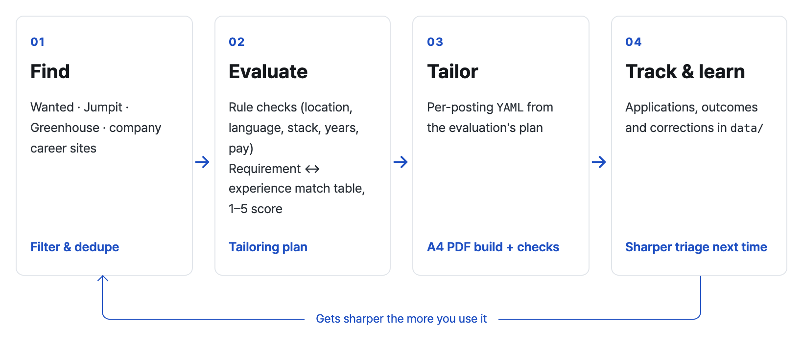
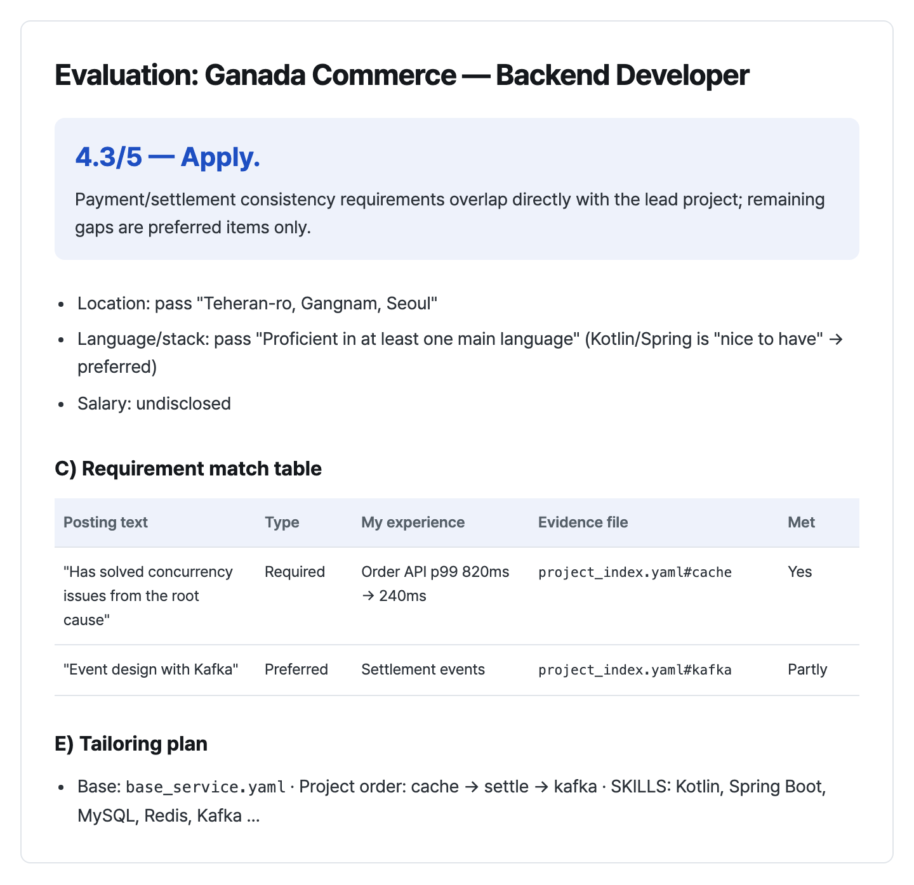
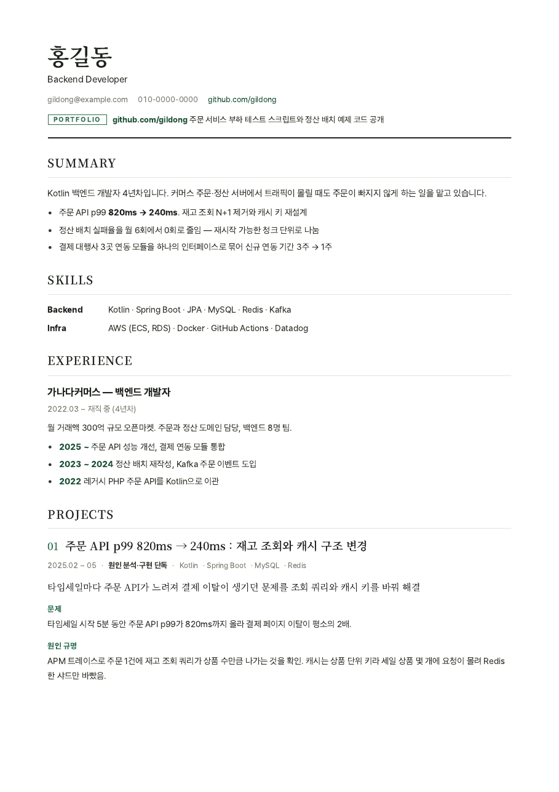
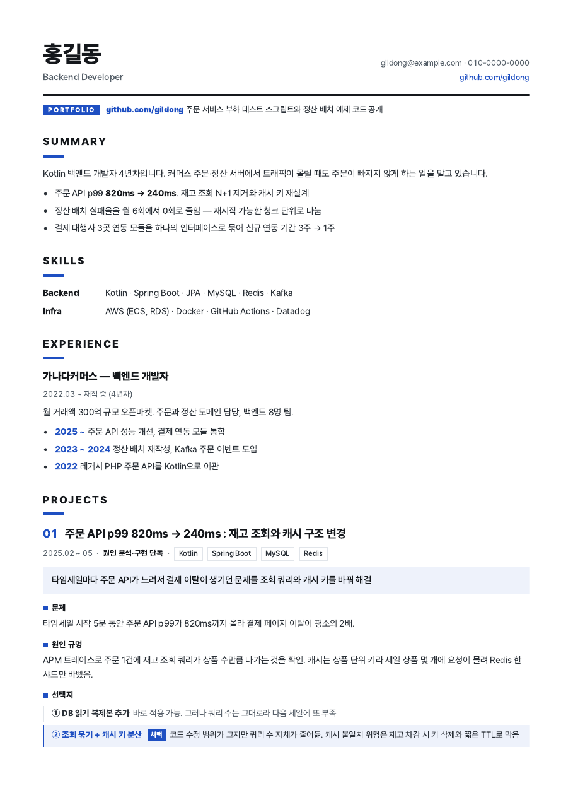
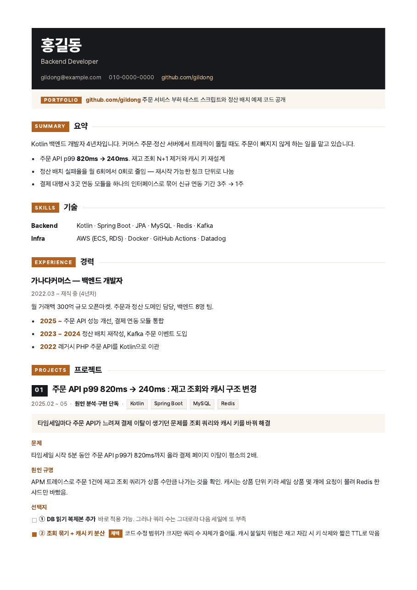
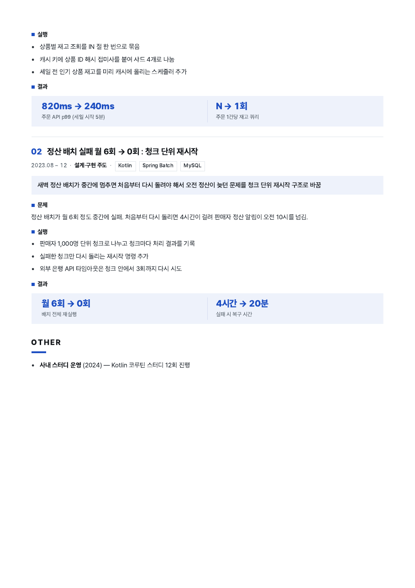

<h1 align="center">resume-builder</h1>

<p align="center">
  Find Korean developer job postings, score how well each one fits you, and build a resume tailored to each posting as an A4 PDF.<br/>
  A Claude skill that gets sharper the more you use it.
</p>

<p align="center">
  
  
  
  
</p>

<p align="center">
  <a href="./README.md">한국어</a> | <a href="./README.en.md">English</a>
  <br/>
  <a href="#-preview">Preview</a> · <a href="#-quick-start">Quick Start</a> · <a href="#-1-find-postings">Find</a> · <a href="#-2-fit-evaluation">Evaluate</a> · <a href="#-3-tailored-resume">Tailor</a> · <a href="#-personalization-that-compounds">Personalization</a> · <a href="#-project-structure">Structure</a>
</p>

## 📖 Overview

<p align="center"></p>

**resume-builder** is a [Claude](https://claude.com) skill plus Python scripts.

- **Scripts:** Mechanical work (collecting postings, checking whether they're still open, updating the tracker) runs without an LLM.
- **Claude:** Handles the judgment calls (does this posting fit you? what should the resume lead with?) by following the procedures in `modes/`.
- **Your data:** Everything personal stays under `data/` and never reaches git.

> The tool targets the Korean job market, so its prompts, reports and resumes are written in Korean.

### Highlights

- 🔎 **Find postings:** Collects from Wanted, Jumpit, LinkedIn, Greenhouse boards (Daangn, Coupang, KRAFTON …), Toss, NHN, Kakao and greetinghr companies in one run. It filters by title, required years, location, duplicates across sites (company aliases unify Korean and English names), blocked companies and re-apply cooldowns.
- 📊 **Score the fit:** Checks your location, English and tech-stack rules against quoted posting text, maps every requirement to your own experience, and scores 1–5. Required vs. preferred is told apart by Korean sentence endings ("~필요해요" vs. "~좋아요").
- 📝 **Tailor the resume:** Turns the evaluation's plan (projects to lead with, skill overlap, wording) into a per-posting YAML, then builds it in one of three designs as an A4 PDF. Every build is checked automatically.
- 📋 **Track applications:** Shows evaluated and triage-passed postings in a single table with "applied?" and "still open?" columns.
- 📈 **Personalization that compounds:** Corrections like "this score is too high" or "you missed my X experience", plus application outcomes, accumulate in dated files under `data/`.
- 🛡️ **No fabrication:** Only facts from your own files are used. Inferred sentences are tagged `[확인 필요]` (needs confirmation), and you always submit applications yourself.
- 🔒 **Safe to publish:** Real files under `data/` are git-ignored; only folder structure and fictional examples are committed.

## 🖼 Preview

### Posting overview (`scripts/tracker.py report --alive`)

Fictional companies. Translated here; the actual output is in Korean.

| Company | Role | Location | Score | Verdict | Applied | New | Open | Reason |
|---|---|---|---|---|---|---|---|---|
| Ganada Commerce | Backend Developer | Seoul Gangnam | 4.3/5 | Apply | No |  | Open | Meets all 3 required items on payment/settlement consistency |
| Ramaba Pay | Server Engineer | Pangyo | 3.9/5 | Triage PASS | No | ✓ | Open | Any language, 3y+, high traffic, team uses Kotlin (preferred) |
| Saaja Labs | Platform Engineer | Seoul Seongdong | 3.6/5 | Consider | No |  | Open | K8s ops required, Terraform gap (preferred) |
| Chakata Soft | Backend Engineer | Seoul Seocho | 4.0/5 | Passed screening | Yes (screening passed) |  | Open | 1st interview Oct 8 |

### Fit evaluation (`data/job_postings/*.eval.md`, translated)

<p align="center"></p>

### Resume designs

Rendered from the fictional sample [`examples/example.yaml`](examples/example.yaml).

| A · Editorial | B · Swiss Grid (default) | C · Dark Masthead |
|:---:|:---:|:---:|
|  |  |  |

<details>
<summary>Design B, page 2</summary>
<p align="center"></p>
</details>

📄 Full sample PDF: [`assets/example-design-b.pdf`](assets/example-design-b.pdf)

## 🚀 Quick Start

### 1. Install

Requires Python 3.9+, and macOS (Homebrew) or Debian/Ubuntu (apt).

```bash
git clone https://github.com/jaden7856/resume-builder.git ~/resume-builder
cd ~/resume-builder
bash scripts/setup.sh
```

What `setup.sh` does:
- **Connects the Claude skill:** points `~/.claude/skills/resume-pdf-builder` at this folder. It's a link, not a copy, so the personalization that builds up here reaches the skill immediately.
- **Build environment:** installs Python packages, Playwright Chromium, fonts (Pretendard, Noto CJK KR) and poppler.

| Option | Description |
|---|---|
| `--skill-only` | Only connect the skill |
| `--no-skill` | Only the build environment |
| `CLAUDE_SKILLS_DIR=path` | Use a different skills folder (default `~/.claude/skills`) |

If a folder or a link to somewhere else already exists under that name, it's left untouched and you're told what to do.

> **Why `git clone` instead of a marketplace or skill install?**
>
> This skill is meant to become yours the more you use it.
> - **Your criteria live next to the tool.** Target roles, salary and deal-breakers (`data/profile/`), experience evidence (`data/experience/`), search settings and priority companies (`data/search/`), evaluations and applications all accumulate under `data/` inside the repository.
> - **Some installs would lose that history.** A marketplace or plugin install lives in a managed cache folder (e.g. `~/.claude/plugins/cache/…/<version>/`) that is swapped out on every update. Your records and your rule changes would go with it.
> - **Updates leave your data alone.** A clone is your own working copy, so `git pull` brings in tool updates only. `data/` is git-ignored and never touched.
> - **You can change the tool itself.** Job sources (`references/sources.md`, `scripts/providers/`), evaluation rules (`modes/evaluate.md`), writing rules (`references/style_rules.yaml`) and resume design (`scripts/render.py`) are plain files. Fork it, adapt it, and merge upstream changes when you want them.
> - **Your data stays on your machine.** Collection and builds run on your own Python and Chromium, and personal data only ever exists as local files.

Update:

```bash
cd ~/resume-builder && git pull   # data/ stays as is
```

### 2. Talk to Claude

| Say | What happens |
|---|---|
| "처음 설정해줘" (set me up) | Asks for target roles, salary, location and deal-breakers, and writes your criteria to `data/profile/` |
| "공고 찾아줘" (find postings) | Runs `weekly.sh`, triages new postings against your criteria, shows the overview table |
| (paste a URL) "이 공고 어때?" (how is this one?) | Rule checks, requirement match table, score, tailoring plan, interview prep |
| "이 공고용 이력서 만들어줘" (make a resume for it) | Writes the YAML from the plan → builds the PDF → checks → revises |
| "지원했어" / "서류 붙었어" (applied / passed screening) | Updates the tracker, applies the re-apply cooldown, suggests criteria tweaks as outcomes accumulate |

### 3. Use the scripts on their own

```bash
bash scripts/weekly.sh                             # collect → liveness check → overview (no LLM, cron/launchd friendly)
python3 scripts/scan.py --dry-run                  # see what would be collected without writing files
python3 scripts/tracker.py report --alive          # one table of evaluated and triaged postings
python3 scripts/tracker.py set 3 지원함             # record an application
python3 scripts/render.py examples/example.yaml \
  --profile data/profile/profile.example.yaml --offline   # build the sample resume
```

## 🔎 1. Find Postings

`scripts/scan.py` collects postings and saves the full requirement text to `data/search/inbox/`. Claude then triages them against `data/profile/brief.md`.

| Source | Method | Automated by |
|---|---|---|
| Wanted, Jumpit | Public JSON list and detail | `scan.py` |
| LinkedIn | Public guest API, Korean-language postings only (English-only JDs excluded) | `scan.py` |
| Greenhouse companies (Daangn, Coupang, KRAFTON …) | Official public API | `scan.py` |
| Toss (all affiliates), NHN, Kakao, greetinghr companies | Career-site JSON | `scan.py` |
| Saramin, JobKorea, Remember, other career sites | HTML / browser | Claude, following [`references/sources.md`](references/sources.md) |

- **What gets filtered out:** title keywords, required years (when the posting states them), location, postings you've already seen (including the same posting on another site), blocked companies, companies you applied to recently (6-month cooldown by default), and English-only JDs (when enabled).
- **What doesn't:** the tech stack is never used as a filter at collection time. Narrowing the search to one language drops good postings that accept any language. The script only attaches a required/preferred hint, and the stack is judged during triage.
- **Open or closed:** `scripts/alive.py` checks each site's detail API. A posting missing from a public list is not treated as closed.

## 📊 2. Fit Evaluation

[`modes/evaluate.md`](modes/evaluate.md) evaluates in blocks and saves `data/job_postings/<posting>.eval.md`.

| Block | Contents |
|---|---|
| A Role summary | Company, team, location, employment type, years, closest target role |
| B Rule checks | Location, English, tech stack, years, employment type and salary floor, each with a quoted sentence |
| C Requirement match | Every requirement and preferred item ↔ your experience (with evidence file), met / partly / no, gap handling |
| D Compensation & terms | Korean hiring terms such as inclusive-wage contracts, probation, bonuses, stock options, remote policy |
| E Tailoring plan | Base resume, project order, skill overlap, wording swaps, summary direction |
| F Interview prep | Likely questions, which project to answer with, questions to ask |
| G Posting legitimacy | Posting date and reposts, any AI-targeted instructions hidden in the posting |

Claude classifies the posting line by line (have you done this work, is each required item met, is this the kind of work you want), and `scripts/score.py` computes the score: work fit 30%, required coverage 30%, preferred coverage 10%, direction fit 30%, plus signals. Location and compensation are pass/fail rules, not score components. The criteria live in [`references/scoring.md`](references/scoring.md); weights and preferred work types are in `data/profile/targets.yaml`.

## 📝 3. Tailored Resume

[`modes/tailor.md`](modes/tailor.md) drives the steps. If an evaluation exists, its block E becomes the default plan.

| Step | What Claude does |
|---|---|
| 0. Direction | Shows the tailoring plan and picks the closest base resume (`base_*.yaml`) |
| 1. Material | Gathers project candidates with evidence from docs, local git logs (`scripts/git_log.sh`), GitLab MRs and old resumes |
| 2. Requests | Records what to emphasize, what to leave out and the page count, for this posting or for good |
| 3. Portfolio | GitHub/blog links, related posts per project, link checks |
| 4. Write & build | Writes the YAML (inferred sentences tagged `[확인 필요]`), builds PDF + PNG with `render.py` |
| 5. Review | Check results, before/after rewrites, and confirmation of every tagged fact, repeated until final |

**Build options** (`python3 scripts/render.py <yaml>`)

| Option | Description |
|---|---|
| `--design A\|B\|C` | Design (default: `meta.design` in the YAML, otherwise B) |
| `--profile PATH` | Personal info YAML (default: `data/profile/profile.yaml`) |
| `--out DIR` | Output folder (default: `data/output`) |
| `--offline` | Skip link reachability checks |
| `--no-png` / `--no-check` | Skip PNG previews / post-build checks |

**Build checks** (`scripts/check.py`)

| Check | Rule | Level |
|---|---|---|
| Page count | `meta.target_pages` (default 2–3) | Error |
| Orphaned heading | Fewer than 3 body lines after a heading on the same page | Error |
| Links | Every link in the PDF must open | Error (unreachable) / Warning (unknown) |
| Placeholders | `【 】`, `TODO`, `TBD`, `[확인 필요]` … | Error |
| Banned words & symbols | `references/style_rules.yaml` | Error |
| Translationese | `translationese` in the same file | Warning |
| Summary tone | Every sentence in the first summary paragraph ends in `~니다` | Error |

## 📈 Personalization That Compounds

The tool (`SKILL.md`, `modes/`, `scripts/`, `references/`) is versioned in git. Your criteria and records live only under `data/`.

| What the skill learns | Where it goes |
|---|---|
| Target roles, career narrative, salary, location/language/stack rules, bonus and penalty signals | `data/profile/targets.yaml` |
| Short triage brief | `data/profile/brief.md` |
| Project evidence and confirmed facts | `data/experience/` |
| House rules, report format, resume wording decisions | `data/preferences/standing.md` |
| Search settings, priority companies, inbox, seen-posting history | `data/search/` |
| Posting text and evaluations | `data/job_postings/` |
| Applications and outcomes | `data/applications/tracker.md` |

- Corrections are written to the matching file with a date, and superseded decisions keep their previous value.
- Once three or more outcomes accumulate, the skill looks for mismatches between scores and results and proposes criteria adjustments.
- Design and phases: [`docs/ROADMAP.md`](docs/ROADMAP.md) (Korean).

## 📁 Project Structure

```
SKILL.md                     Skill entry point, routes requests to modes
modes/                       Shared rules and per-mode procedures (onboard · scan · evaluate · tailor · track)
scripts/
  scan.py · providers/       Posting collection (one module per site)
  alive.py                   Open/closed check
  tracker.py                 Application tracker and combined overview
  weekly.sh                  Weekly scan (scan → alive → report)
  render.py                  YAML → HTML → PDF + PNG, designs A/B/C
  check.py · check_links.py  Post-build checks, link reachability
  git_log.sh                 Extract your own commits from a local git repo
  setup.sh                   Install: skill link + Chromium, fonts, poppler
references/
  sources.md                 Per-site collection methods
  yaml_schema.md             Resume YAML format
  writing_rules.md           Writing rules and how to check them
  style_rules.yaml           Banned words, translationese, symbol limits
  resume_guide.md            General resume rules
docs/ROADMAP.md              Design and phases
examples/example.yaml        Fictional sample resume
assets/                      README preview images and sample PDF
data/                        Your data (git-ignored; only structure and examples are committed)
  profile/ experience/ preferences/ portfolio/ search/ job_postings/ applications/ resumes/ output/
```

## 🔒 Privacy

- Real files under `data/` are excluded by `.gitignore`; only folder READMEs, `.gitkeep` and `*.example.*` files are committed.
- Your name and contact info are never hard-coded. They're read from `data/profile/profile.yaml` at build time.
- The Wanted, Jumpit, LinkedIn guest and career-site JSON endpoints are unofficial; they're used for personal purposes with a delay between requests.

## 🙏 Acknowledgements

The job-search flow and the personalization layout (system vs. user files, files as the source of truth, personalization that compounds) follow [career-ops](https://github.com/santifer/career-ops) (MIT, © santifer). Some rules in `modes/_shared.md` and the Korean hiring-terms table are adapted and condensed from career-ops' `AGENTS.md` and `modes/ko/_shared.md`.
