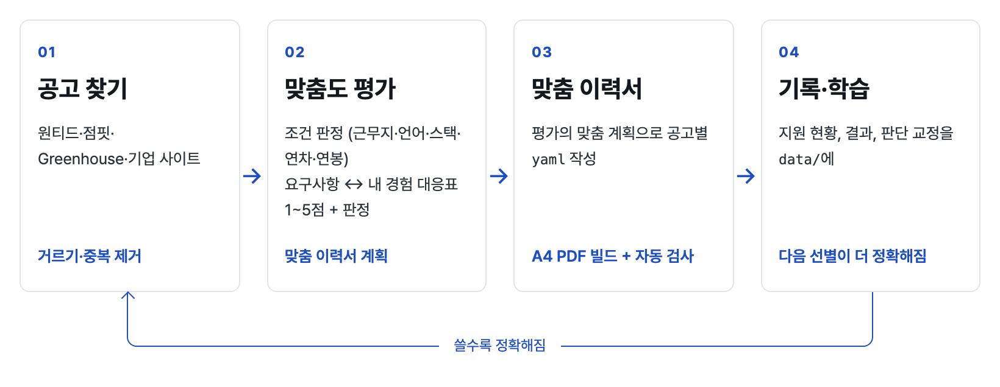
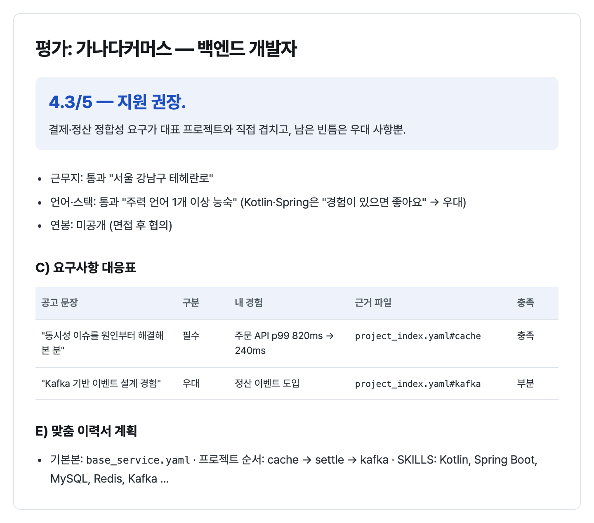

<h1 align="center">resume-builder</h1>

<p align="center">
  한국 개발자 채용 공고를 찾고, 나와 얼마나 맞는지 평가하고, 공고마다 맞춘 이력서를 A4 PDF로 만듭니다.<br/>
  쓸수록 내 기준이 쌓여 선별과 이력서가 정확해지는 Claude 스킬입니다.
</p>

<p align="center">
  
  
  
  
</p>

<p align="center">
  <a href="./README.md">한국어</a> | <a href="./README.en.md">English</a>
  <br/>
  <a href="#-미리보기">미리보기</a> · <a href="#-빠른-시작">빠른 시작</a> · <a href="#-1-공고-찾기">공고 찾기</a> · <a href="#-2-맞춤도-평가">맞춤도 평가</a> · <a href="#-3-맞춤-이력서">맞춤 이력서</a> · <a href="#-쓸수록-정확해지는-개인화">개인화</a> · <a href="#-폴더-구조">폴더 구조</a>
</p>

## 📖 소개

<p align="center"></p>

**resume-builder**는 [Claude](https://claude.com) 스킬과 Python 스크립트로 이루어져 있습니다.

- **스크립트:** 공고 수집, 마감 확인, 지원 현황 기록처럼 판단이 필요 없는 일은 LLM 없이 처리합니다.
- **Claude:** 공고가 나와 맞는지, 이력서에 무엇을 앞세울지처럼 판단이 필요한 일을 맡고, 모드 문서(`modes/`)의 절차대로 진행합니다.
- **개인 자료:** 전부 `data/`에만 쌓이고 git에 올라가지 않습니다.

### 특징

- 🔎 **공고 찾기:** 원티드·점핏·Greenhouse(당근·쿠팡·크래프톤 등)·토스·NHN·카카오·greetinghr 기업을 한 번에 수집합니다. 제목·연차·근무지, 중복, 제외 회사, 재지원 쿨다운을 자동으로 거릅니다.
- 📊 **맞춤도 평가:** 근무지·영어·기술 스택 조건을 공고 문장 근거와 함께 판정합니다. 자격요건·우대사항 한 줄마다 내 경험을 연결해 1~5점으로 매깁니다. 필수와 우대는 "~필요해요"와 "~좋아요" 같은 문장 끝으로 구분합니다.
- 📝 **맞춤 이력서:** 평가에서 나온 계획(앞세울 프로젝트, 기술 교집합, 용어)으로 공고별 yaml을 만들고, 디자인 3종 중 하나로 A4 PDF를 빌드합니다. 빌드할 때마다 페이지 수·링크·문체를 자동으로 검사합니다.
- 📋 **지원 현황:** 평가한 공고와 선별을 통과한 공고를 표 하나에 모아 지원 여부와 마감 여부를 함께 보여 줍니다.
- 📈 **쓸수록 정확해지는 개인화:** "점수가 너무 높다", "내 X 경험을 놓쳤다" 같은 교정과 서류 결과가 `data/`의 기준 파일에 날짜와 함께 쌓입니다.
- 🛡️ **지어내지 않음:** 경험·수치는 내 자료에 있는 것만 씁니다. 추론한 문장은 `[확인 필요]`로 표시하고, 지원서 제출은 사용자가 직접 합니다.
- 🔒 **공개해도 안전:** `data/` 아래 실제 자료는 git에서 빠지고, 폴더 구조와 가상 예시만 올라갑니다.

## 🖼 미리보기

### 공고 현황표 (`scripts/tracker.py report --alive`)

가상 회사로 만든 예시입니다.

| 회사 | 포지션 | 근무지 | 점수 | 판정 | 지원 여부 | 새로 찾음 | 마감 | 한 줄 근거 |
|---|---|---|---|---|---|---|---|---|
| 가나다커머스 | 백엔드 개발자 | 서울 강남 | 4.3/5 | 지원 권장 | 미지원 |  | 열림 | 결제·정산 정합성 필수 요건 3/3 충족, 자체 서비스 |
| 라마바페이 | Server Engineer | 판교 | 3.9/5 | 1차 PASS | 미지원 | ✓ | 열림 | 언어 무관 3년+ · 대규모 트래픽 · 팀 Kotlin(우대) |
| 사아자랩스 | Platform Engineer | 서울 성동 | 3.6/5 | 지원 고려 | 미지원 |  | 열림 | K8s 운영 필수 · Terraform 갭(우대) |
| 차카타소프트 | 백엔드 엔지니어 | 서울 서초 | 4.0/5 | 서류합격 | 지원함 (서류합격) |  | 열림 | 1차 면접 10/8 |

### 맞춤도 평가 (`data/job_postings/*.eval.md`)

<p align="center"></p>

### 맞춤 이력서 디자인

가상 인물 예시 [`examples/example.yaml`](examples/example.yaml)로 만든 결과입니다.

| A · 에디토리얼 | B · 스위스 그리드 (기본) | C · 다크 마스트헤드 |
|:---:|:---:|:---:|
|  |  |  |

<details>
<summary>디자인 B, 2쪽</summary>
<p align="center"></p>
</details>

📄 전체 예시 PDF: [`assets/example-design-b.pdf`](assets/example-design-b.pdf)

## 🚀 빠른 시작

### 1. 설치

Python 3.9 이상, macOS(Homebrew) 또는 Debian/Ubuntu(apt)가 필요합니다.

```bash
git clone https://github.com/jaden7856/resume-builder.git ~/resume-builder
cd ~/resume-builder
bash scripts/setup.sh
```

`setup.sh`가 하는 일:
- **Claude 스킬 연결:** `~/.claude/skills/resume-pdf-builder`가 이 폴더를 가리키게 합니다. 복사가 아니라 링크라서, 이 폴더에 쌓이는 개인화가 스킬에 바로 반영됩니다.
- **빌드 환경:** Python 패키지, Playwright Chromium, 폰트(Pretendard, Noto CJK KR), poppler를 설치합니다.

| 옵션 | 설명 |
|---|---|
| `--skill-only` | 스킬 연결만 |
| `--no-skill` | 스킬 연결 없이 빌드 환경만 |
| `CLAUDE_SKILLS_DIR=경로` | 스킬 폴더 위치를 바꿀 때 (기본 `~/.claude/skills`) |

같은 이름의 폴더나 다른 곳을 가리키는 링크가 이미 있으면 덮어쓰지 않고 알려 줍니다.

> **왜 마켓플레이스·스킬 설치가 아니라 `git clone`인가요?**
>
> 이 스킬은 쓸수록 내 것이 되도록 만들었습니다.
> - **내 기준이 도구 옆에 쌓입니다.** 목표 역할·연봉·제외 조건(`data/profile/`), 경험 근거(`data/experience/`), 검색 조건·우선 기업(`data/search/`), 평가와 지원 기록이 모두 저장소 안 `data/`에 쌓입니다.
> - **설치 방식에 따라 기록이 사라질 수 있습니다.** 마켓플레이스·플러그인으로 설치한 스킬은 관리되는 캐시 폴더(예: `~/.claude/plugins/cache/…/<버전>/`)에 들어가고, 업데이트할 때 버전 폴더째 바뀝니다. 그러면 거기 쌓인 개인 기록과 내가 고친 규칙이 함께 사라집니다.
> - **업데이트해도 내 기록은 그대로입니다.** clone한 폴더는 내 작업 사본이라 `git pull`로 도구만 받아옵니다. `data/`는 `.gitignore`로 빠져 있어 업데이트가 건드리지 않습니다.
> - **도구 자체를 고쳐 쓸 수 있습니다.** 수집 사이트(`references/sources.md`, `scripts/providers/`), 평가 기준(`modes/evaluate.md`), 문체 규칙(`references/style_rules.yaml`), 이력서 디자인(`scripts/render.py`)이 모두 평범한 파일입니다. fork해서 내 방식대로 바꾸고 원본의 업데이트는 merge로 받으면 됩니다.
> - **자료가 내 PC 밖으로 나가지 않습니다.** 공고 수집과 이력서 빌드는 이 PC의 Python·Chromium으로 돌고, 개인 자료는 로컬 파일로만 남습니다.

업데이트:

```bash
cd ~/resume-builder && git pull   # data/ 는 그대로
```

### 2. Claude에게 이렇게 말하면 됩니다

| 말하기 | 일어나는 일 |
|---|---|
| "처음 설정해줘" | 목표 역할·연봉·근무지·제외 조건을 묻고 `data/profile/`에 기준을 만듭니다 |
| "공고 찾아줘" | `weekly.sh`로 수집한 뒤, 새 공고를 내 기준으로 1차 선별해 현황표로 보여 줍니다 |
| (공고 URL을 붙여넣고) "이 공고 어때?" | 조건 판정, 요구사항 대응표, 점수, 맞춤 이력서 계획, 면접 준비 |
| "이 공고용 이력서 만들어줘" | 평가의 계획으로 yaml 작성 → PDF 빌드 → 검사 → 수정 반복 |
| "지원했어" / "서류 붙었어" | 현황표 갱신, 재지원 쿨다운 적용, 결과가 쌓이면 기준 조정 제안 |

### 3. 스크립트만 따로 쓰기

```bash
bash scripts/weekly.sh                             # 수집 → 마감 확인 → 현황표 (LLM 없이, cron·launchd 가능)
python3 scripts/scan.py --dry-run                  # 파일을 쓰지 않고 수집 결과만 보기
python3 scripts/tracker.py report --alive          # 평가·선별 공고 한 표로 (마감 여부 포함)
python3 scripts/tracker.py set 3 지원함             # 지원 기록
python3 scripts/render.py examples/example.yaml \
  --profile data/profile/profile.example.yaml --offline   # 예시 이력서 빌드
```

## 🔎 1. 공고 찾기

`scripts/scan.py`가 공고를 수집하고, 자격요건 본문을 `data/search/inbox/`에 저장합니다. 1차 선별은 Claude가 `data/profile/brief.md`의 기준으로 합니다.

| 소스 | 방법 | 자동화 |
|---|---|---|
| 원티드, 점핏 | 공개 JSON 목록·상세 | `scan.py` |
| Greenhouse 기업 (당근, 쿠팡, 크래프톤 …) | 공식 공개 API | `scan.py` |
| 토스 전 계열사, NHN, 카카오, greetinghr 기업 | 채용 사이트 JSON | `scan.py` |
| 사람인, 잡코리아, LinkedIn, 리멤버, 기타 기업 사이트 | HTML·브라우저 | Claude가 [`references/sources.md`](references/sources.md)대로 수집 |

- **거르는 기준:** 제목 키워드, 요구 연차(숫자가 있을 때), 근무지, 이미 본 공고, 제외 회사, 지원 후 재지원 쿨다운(기본 6개월).
- **거르지 않는 기준:** 기술 스택은 수집할 때 거르지 않습니다. 검색어를 특정 언어로 좁히면 언어를 따지지 않는 좋은 공고가 빠지기 때문이에요. 수집 단계에서는 자격요건 문장의 필수/우대 힌트만 붙이고, 판정은 선별 단계에서 합니다.
- **마감 판정:** `scripts/alive.py`가 사이트별 상세 API로 확인합니다. 공개 목록에서 사라졌다고 마감으로 보지 않습니다.

## 📊 2. 맞춤도 평가

[`modes/evaluate.md`](modes/evaluate.md)의 블록 순서로 평가하고 `data/job_postings/<공고>.eval.md`에 남깁니다.

| 블록 | 내용 |
|---|---|
| A 역할 요약 | 회사·팀·근무지·고용 형태·연차, 내 목표 역할 중 가장 가까운 것 |
| B 조건 판정 | 근무지·영어·기술 스택·연차·고용 형태·연봉 하한을 공고 문장 인용과 함께 판정 |
| C 요구사항 대응표 | 자격요건·우대사항 ↔ 내 경험(근거 파일), 충족 / 부분 / 없음, 빈틈 대응 |
| D 보상·근무 조건 | 포괄임금제, 수습, 성과급·스톡옵션, 재택 등 한국 채용 조건 |
| E 맞춤 이력서 계획 | 기본본, 프로젝트 순서, SKILLS 교집합, 용어 치환, SUMMARY 방향 |
| F 면접 준비 | 예상 질문, 답에 쓸 프로젝트, 역질문 |
| G 공고 신뢰도 | 게시일·재게시, 공고 안의 AI 대상 지시문 |

점수는 역할 적합 30%, 요구사항 충족 30%, 서사 적합 15%, 근무지·조건 15%, 보상 10%에 가점·감점 신호를 더합니다. 가중치는 `data/profile/targets.yaml`에서 바꿀 수 있어요.

## 📝 3. 맞춤 이력서

[`modes/tailor.md`](modes/tailor.md)의 순서로 진행합니다. 평가가 있으면 E블록의 계획을 그대로 추천안으로 씁니다.

| 단계 | Claude가 하는 일 |
|---|---|
| 0. 지원 방향 | 평가의 맞춤 계획을 보여 주고 가장 가까운 기본본(`base_*.yaml`)을 고릅니다 |
| 1. 자료 수집 | 경험 문서, 로컬 git 로그(`scripts/git_log.sh`), GitLab MR, 기존 이력서에서 근거와 함께 프로젝트 후보를 모읍니다 |
| 2. 추가 요구사항 | 강조할 점, 뺄 내용, 페이지 수를 이번 공고용 또는 계속 쓸 설정으로 저장합니다 |
| 3. 포트폴리오 | GitHub·블로그 링크와 프로젝트별 관련 글, 링크 접속 확인 |
| 4. 작성과 빌드 | yaml 작성(추론 문장은 `[확인 필요]`), `render.py`로 PDF·PNG 빌드 |
| 5. 검수와 수정 | 검사 결과, 수정 전·후 문장, 태그 붙은 사실 확인을 확정할 때까지 반복합니다 |

**빌드 옵션** (`python3 scripts/render.py <yaml>`)

| 옵션 | 설명 |
|---|---|
| `--design A\|B\|C` | 디자인 (기본: yaml `meta.design`, 없으면 B) |
| `--profile PATH` | 개인정보 yaml (기본: `data/profile/profile.yaml`) |
| `--out DIR` | 산출물 폴더 (기본: `data/output`) |
| `--offline` | 링크 접속 검사 생략 |
| `--no-png` / `--no-check` | PNG 미리보기 / 빌드 후 검사 생략 |

**빌드 후 검사** (`scripts/check.py`)

| 항목 | 기준 | 수준 |
|---|---|---|
| 페이지 수 | `meta.target_pages` (기본 2~3) | 오류 |
| 제목 홀로 남음 | 제목 뒤 같은 쪽 본문 3줄 미만 | 오류 |
| 링크 | PDF 안 모든 링크 접속 | 열리지 않음=오류, 확인 불가=경고 |
| 플레이스홀더 | `【 】`, `TODO`, `TBD`, `[확인 필요]` … | 오류 |
| 금지어 · 기호 | `references/style_rules.yaml` | 오류 |
| 번역투 · 개념어 | 같은 파일 `translationese` | 경고 |
| SUMMARY 말투 | 첫 문단 문장마다 `~니다`로 끝남 | 오류 |

## 📈 쓸수록 정확해지는 개인화

도구(`SKILL.md`, `modes/`, `scripts/`, `references/`)는 git에 올라가고, 내 기준과 기록은 `data/`에만 쌓입니다.

| 알게 된 것 | 쌓이는 곳 |
|---|---|
| 목표 역할, 이직 서사, 연봉, 근무지·언어·스택 조건, 가점·감점 신호 | `data/profile/targets.yaml` |
| 1차 선별용 짧은 요약 | `data/profile/brief.md` |
| 경험·프로젝트 근거, 확인받은 사실 | `data/experience/` |
| 작업 규칙, 보고 형식, 이력서 표현 결정 | `data/preferences/standing.md` |
| 검색 조건, 우선 기업, 대기함, 본 공고 기록 | `data/search/` |
| 공고 원문과 평가 | `data/job_postings/` |
| 지원 현황과 결과 | `data/applications/tracker.md` |

- 판단을 교정하면 그 성격에 맞는 파일에 날짜와 함께 적습니다. 바뀐 결정은 지우지 않고 이전 값을 남깁니다.
- 지원 결과가 3건 이상 쌓이면, 점수와 실제 결과가 어긋난 부분을 찾아 기준 조정을 제안합니다.
- 설계와 단계는 [`docs/ROADMAP.md`](docs/ROADMAP.md)에 있습니다.

## 📁 폴더 구조

```
SKILL.md                     스킬 진입점, 요청을 모드로 연결
modes/                       공통 규칙과 모드별 절차 (onboard · scan · evaluate · tailor · track)
scripts/
  scan.py · providers/       공고 수집 (사이트별 모듈)
  alive.py                   마감 확인
  tracker.py                 지원 현황 기록, 통합 현황표
  weekly.sh                  주간 스캔 (scan → alive → report)
  render.py                  yaml → HTML → PDF + PNG, 디자인 A/B/C
  check.py · check_links.py  빌드 후 검사, 링크 접속 확인
  git_log.sh                 로컬 git 저장소에서 내 커밋 로그 추출
  setup.sh                   설치: 스킬 연결 + Chromium, 폰트, poppler
references/
  sources.md                 채용 사이트별 수집 방법
  yaml_schema.md             이력서 yaml 형식
  writing_rules.md           문장 규칙과 점검 방법
  style_rules.yaml           금지어 · 번역투 · 기호 한도
  resume_guide.md            이력서 일반 규칙
docs/ROADMAP.md              설계와 단계
examples/example.yaml        가상 인물 예시
assets/                      README 미리보기 이미지와 예시 PDF
data/                        내 자료 (git 제외, 구조와 예시만 올라감)
  profile/ experience/ preferences/ portfolio/ search/ job_postings/ applications/ resumes/ output/
```

## 🔒 개인정보

- `data/` 아래 실제 파일은 `.gitignore`로 빠지고, 폴더 README·`.gitkeep`·`*.example.*`만 올라갑니다.
- 이름·연락처는 코드에 없고, 빌드할 때 `data/profile/profile.yaml`에서 읽습니다.
- 원티드·점핏·기업 사이트 JSON은 비공식 엔드포인트라 개인 용도로 요청 간격을 두고 씁니다.

## 🙏 참고

공고 탐색·평가 흐름과 개인화 파일 구조(시스템/사용자 파일 분리, 파일이 원본, 쓸수록 개인화)는 [career-ops](https://github.com/santifer/career-ops)(MIT, © santifer)를 참고했습니다. `modes/_shared.md`의 규칙 일부와 한국 채용 용어 표는 career-ops의 `AGENTS.md`, `modes/ko/_shared.md`를 옮기고 줄인 것입니다.
